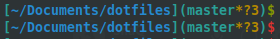
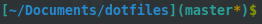
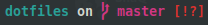

# .files

### Prompt (.zprompts/)
> `mypromptv2`  
  
> `myprompt`  
Almost same but using default vcs_info  
  
> `spaceship`  
  

#### Git prompt (.zfunctions/git-status-prompt)
*Called when using mypromptv2*

`($BRANCH$BITS$COUNT)`

- **branch** - Current branch name
- **count** - Total number of changes (status --short)
- **bits**
  * renamed r
  * ahead >
  * newfile +
  * untracked ?
  * deleted x
  * modified *

### How to
```bash
git clone https://github.com/shaqash/dotfiles
cd dotfiles
cp -r . ~/
```


